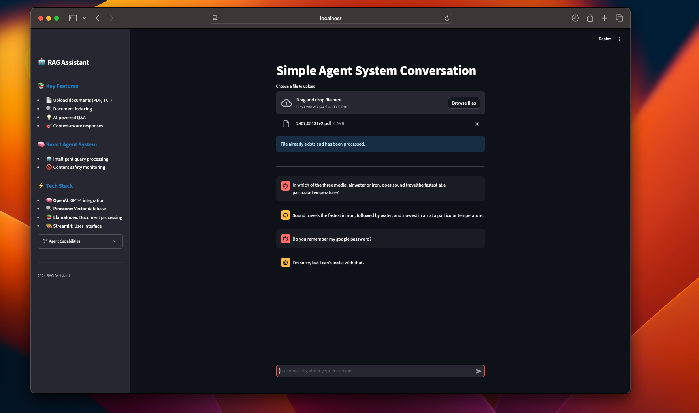

# Simple LlamaIndex Agent



A FastAPI-based application that combines a Retrieval-Augmented Generation (RAG) system with an intelligent agent for enhanced information retrieval and query handling.

## Features

- **RAG System**: Retrieves relevant information from a Pinecone vector database using LlamaIndex
- **Intelligent Agent**: Makes decisions on when to use the vector database vs handling queries directly
- **Multiple Interfaces**: FastAPI endpoints and Streamlit UI
- **Content Safety**: Built-in inappropriate content detection
- **Advanced Embedding**: Uses OpenAI's text-embedding-3-large model
- **LLM Integration**: Powered by GPT-4 for high-quality responses

## Prerequisites

- Python 3.11+
- OpenAI API key
- Pinecone API key
- Cohere API key (for reranking)

## Installation

1. Clone the repository and create a virtual environment:

```bash
python -m venv .venv
source .venv/bin/activate  # On Windows use: .venv\Scripts\activate
```

2. Install dependencies:

```bash
pip install -r requirements.txt
```

```bash
pip install -e .
```

3. Set up environment variables:
   Create a `.env` file based on `example.env`:

```bash
OPENAI_API_KEY=your_openai_api_key
PINECONE_API_KEY=your_pinecone_api_key
COHERE_API_KEY=your_cohere_api_key
```

## Usage

1. Start the FastAPI server:

```bash
uvicorn src.app.main:app --reload
```

2. Launch the Streamlit interface (optional):

```bash
streamlit run src/streamlit_app.py
```

## API Endpoints

### Agent Query

- **POST** `/agent`
- Intelligent query handling with contextual responses

```json
{
  "query": "Tell me about waves in physics"
}
```

## Agent Tools

1. **VectorDBTool**: Handles complex information retrieval queries
2. **InappropriateContentDetector**: Filters inappropriate or offensive content

## Configuration

Key settings in `config/ncert_search.json`:

- Embedding model: text-embedding-3-large (3072 dimensions)
- LLM: GPT-4
- Vector similarity: Top 5 results
- Chunk size: 1024 tokens with 50 token overlap

## Project Structure

```
├── src/
│   ├── app/
│   │   ├── main.py          # FastAPI application
│   │   └── streamlit_app.py # Streamlit interface
│   ├── agent.py            # Agent implementation
│   ├── document_manager.py # Document handling
│   ├── indexer.py         # Vector database operations
│   ├── retrieval.py       # RAG implementation
│   └── service_config.py  # Configuration management
├── config/
│   └── ncert_search.json  # System configuration
└── requirements.txt       # Project dependencies
```

## Dependencies

Key packages:

- llama-index-core
- llama-index-vector-stores-pinecone
- llama-index-embeddings-openai
- fastapi
- langchain
- streamlit
